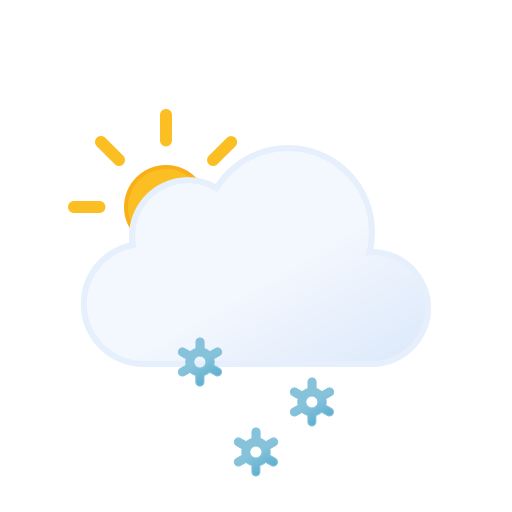

#  Simple Weather

> Simple Weather is a progressive web app which queries the US National Weather Service API — or, worldwide, the Open-Meteo API — to provide a responsive weather forecast.

## ✨ [Demo](https://www.partlycloudy.org/)

> [!CAUTION]
> This should not be your only source of weather data and especially not the only source of severe weather alerts! The Open-Meteo (Global) workflow has no alerts or radar at all — only the NWS workflow shows active alerts.

## Features

- Two forecast sources, switchable in the top nav bar (choice persists):
  - **NWS** — US National Weather Service: current conditions hero with temperature, heat index / wind chill (when NWS provides them), wind, humidity, and precipitation chance; active alerts with app-badge count; radar and watch/warning map overlays
  - **OpenMeteo** — worldwide Open-Meteo: current conditions hero (temperature + feels-like), next ~24 hours chart (temperature / feels-like / precipitation chance), and a 7-day forecast narrated in NWS Zone Forecast Product style — generated on-device by the bundled `src/lib/zfp/` library
  > [!IMPORTANT]
  > The narrative generated from the ZFP library for the OpenMeteo data is a beta and the data source does not include weather alerts. It is a start at applying the US NWS forecast narrative guidelines to the raw data provided from OpenMeteo however it is generated programatically in browser and has some limitations. For example, a hurricane isn't reportable via the OpenMeteo data so ZFP reports "Rain with wind gusts up to 79 mph".
- Use your current location (Geolocation API) or search: full US street address on the NWS side (US Census geocoder), any city worldwide on the OpenMeteo side (Open-Meteo geocoder, pick from up to 5 matches; GPS coordinates are reverse-labeled via OpenStreetMap Nominatim)
- _Forecast in English, Spanish, or French_ (/-switchable in the top nav bar; OpenMeteo narratives are translated too) with metric / US-customary units toggle (defaults follow your browser locale)
- 7-day forecast cards and NOAA NWS radar (OpenFreeMap basemap, dark-mode aware)
- PWA with offline fallback: last forecast per location is cached in `localStorage`, service worker serves `/offline` when unreachable

## Getting started

### Prerequisites

- Node.js 20+ and [pnpm](https://pnpm.io/) — this is a pnpm-only repo (`preinstall: only-allow pnpm`, `engine-strict=true`)

### Install and run locally

```sh
pnpm install
pnpm dev
```

### Useful commands

```sh
pnpm check     # typecheck (svelte-kit sync && svelte-check)
pnpm format    # format all files with Prettier
pnpm format:check  # verify formatting
pnpm lint      # eslint (Svelte + TS, Prettier-compatible)
pnpm test      # unit tests once (Vitest, `src/**/*.test.ts`)
pnpm test:watch  # unit tests in watch mode
pnpm test:coverage  # unit tests with V8 coverage (`/coverage`, gitignored)
pnpm build     # production build
pnpm preview   # build + wrangler dev
pnpm deploy    # build + wrangler deploy (Cloudflare Workers)
pnpm cf-typegen  # regenerate src/worker-configuration.d.ts
```

> [!NOTE]
> CI verifies `pnpm format:check`, `pnpm lint`, `pnpm test`, `pnpm check`, and the `pnpm build` production build.

## Usage

The top nav bar switches providers (**NWS** / **OpenMeteo**), UI language (English / Español / Français), and units (°C / °F, OpenMeteo pages only). Choices persist in `localStorage`. First-time visitors with a non-`en-US` browser language land on the OpenMeteo workflow; `en-US` lands on NWS.

NWS home page — pick one of the two options:

1. **Use my location** — asks for location permission and navigates to `/Weather?lat=&lon=` (coordinates are rounded to 4 decimals). Shows a hint if geolocation is blocked in the browser.
2. **Search by address** — a full US street address is required, e.g. `1600 Pennsylvania Ave SE, Washington, DC`. This goes through the same-origin `/geocode` proxy (US Census Bureau geocoder) to avoid CORS.

OpenMeteo (`/global`) home page — same two-card layout:

1. **Use my location** — worldwide; GPS coordinates are reverse-labeled into a place name via the same-origin `/reverse` proxy (OpenStreetMap Nominatim), falling back to raw coordinates.
2. **Search for a city** — a city name is enough, e.g. `Berlin, Germany`. Queries the Open-Meteo geocoder directly from the browser and offers up to 5 matches to pick from.

Geolocation coordinates go directly from your browser to NWS or Open-Meteo (to fetch the forecast); searched addresses pass through this app's `/geocode` server before being forwarded to the Census geocoder, and GPS coordinates pass through `/reverse` before being forwarded to Nominatim. Coordinates, addresses, and place names you look up are shared with those providers to fetch data — but never otherwise stored or shared by us.

On `/Weather`:

- The header shows `City, State`, coordinates, and when the forecast was updated (or an `Offline — showing cached forecast` notice)
- `← New search` returns home; `↻ Refresh` re-fetches the current coordinates
- Radar toggles control the NWS radar and watches/warnings overlays; tiles refresh about every 5 minutes

On `/global/weather`:

- Same header/refresh/offline behavior, plus a 7-day forecast narrated in NWS Zone Forecast Product style ("Thursday Night", "Friday Day", …) in your UI language
- No alerts, radar, or map — Open-Meteo provides none of those through this app

## How it works

- Fully client-rendered SvelteKit app (`ssr = false`, `prerender = true`) deployed to Cloudflare Workers via `@sveltejs/adapter-cloudflare`.
- `/Weather` fetches `api.weather.gov` directly from the browser: `points/{lat},{lon}` → `forecast` (7-day text) + `forecastGridData` (raw gridpoint numbers for the hourly chart: temperature, heat index, wind chill, precipitation chance, humidity, wind — converted from metric to US units, in parallel; alerts resolve independently so a slow alerts endpoint never blocks the forecast).
- `/global/weather` fetches `api.open-meteo.com` via the `openmeteo` SDK (`best_match` models, `timezone=auto`): hourly temperature, humidity, apparent temperature, precipitation/rain/showers/snowfall, cloud cover, wind + gusts, visibility. The framework-free `src/lib/zfp/` library slices the hourly data into 6am–6pm day / 6pm–6am night periods starting from the current period, then narrates each one ZFP-style (sky, PoP + qualifiers, temp categories + trends, 8-point wind + gusts, snow accumulations) in metric, converting to US units at display only when the locale calls for it; Spanish/French phrasing is seeded from the NWS AWIPS `Translator.py` tables (see `NOTICE`).
- UI strings are compiled with [Paraglide](https://paraglidejs.com/) (no localized URLs; sources in `messages/*.json`, Weblate-friendly) for English, Spanish, and French.
- `src/routes/geocode/+server.ts` is a thin proxy to `geocoding.geo.census.gov` (10s timeout, `address` required, ≤200 chars) returning plain `Response` JSON; `src/routes/reverse/+server.ts` is a thin proxy to OpenStreetMap Nominatim reverse-geocoding (`lat`/`lon` required, 10s timeout) for GPS place names.
- Chart.js is tree-shaken (`chart.js` core only, no `chart.js/auto`, dates via `Intl.DateTimeFormat` + category scale); MapLibre GL JS is lazy-loaded behind an `IntersectionObserver` with its worker via `?worker&url` + `setWorkerUrl`.
- Last forecast per 4-decimal tile is cached in `localStorage` (1h TTL, max 10 tiles, separate `swa:openmeteo:` namespace for the Global workflow) for the offline fallback; the service worker is network-first for navigations (falls back to prerendered `/offline`) and never caches `/geocode`, `/reverse`, or `?` URLs so forecasts stay fresh.
- Content-Security-Policy is generated by SvelteKit (`csp.mode: hash` in `vite.config.ts`) — do not add one to root `_headers`.
- Styling is [Tailwind CSS](https://tailwindcss.com/) v4 (via `@tailwindcss/vite`): utility classes in markup plus a small `@layer base` / `@layer components` block in `src/lib/main.css` (typography, buttons, cards, inputs, chips, tables). Dark mode follows `prefers-color-scheme`; no `style=""` attributes so the CSP needs no `unsafe-inline`.

## Acknowledgments \ Tech Stack

- [National Weather Service Weather.gov API](https://www.weather.gov/documentation/services-web-api)
- [Open-Meteo Weather Forecast API](https://open-meteo.com/) (global forecasts, `best_match` models) + [Geocoding API](https://open-meteo.com/en/docs/geocoding-api) (worldwide city search, GeoNames data)
- Spanish/French forecast phrasing seeded from the NWS AWIPS `Translator.py` tables (Unidata AWIPS2 — see `NOTICE`)
- [SvelteKit](https://kit.svelte.dev/) + [Svelte](https://svelte.dev/)
- [Paraglide](https://paraglidejs.com/) for i18n (English / Español / Français)
- [Tailwind CSS](https://tailwindcss.com/) v4
- [chart.js](https://www.chartjs.org/)
- MapLibre GL JS with [OpenFreeMap](https://openfreemap.org/) basemaps and NOAA NWS radar / watch-warning WMS overlays
- [US Census Bureau Geocoder](https://geocoding.geo.census.gov/)
- Reverse-geocoding by [OpenStreetMap Nominatim](https://nominatim.openstreetmap.org/) (© OpenStreetMap contributors)
- Icon comes from [Meteocons](https://github.com/basmilius/weather-icons)
